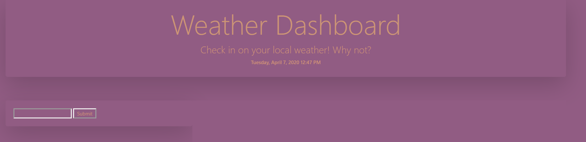
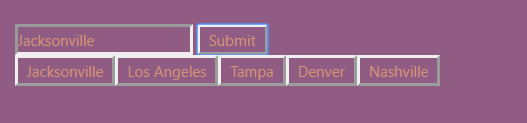

# weatherDashboard
a simple weather application to check the local weather

# Technologies
- HTML
- CSS
- javaScript
- jQuery
- AJAX

# Live Link
- <a href= "https://armcbride.github.io/weatherDashboard/index.html" target= "blank"> Weather Dashboard </a>
- <a href= "https://github.com/armcbride/weatherDashboard" target= "blank"> Repository </a>
- <a href= "https://armcbride.github.io/portfolio/about.html" target= "blank"> Portfolio </a>
# Contributors

- armcbride

# Contact me

- <a href="mailto:armcbride17@gmail.com">Email: armcbride17@gmail.com</a>  

# View

